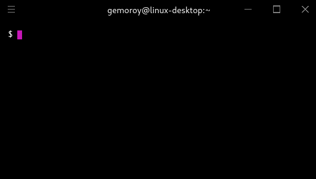

# VENAL for EVE Online
>Yet another [E**VE** O**n**line](https://www.eveonline.com/) m**a**rgin too**l**

<p align="center">
    
</p>

## Install

```
$ npm install venal -g
```

## Usage

After the first run (`venal buy` or `venal sell`) venal will be created `~/.venalrc` file:
```
{
    "path": "",
    "jumps": 0,
    "step": 0.01,
    "fees": {
        "broker": 0.02,
        "tax": 0.01
    }
}
```
You must specify the path for eve online market logs directory. To find this path, you can use the following command:

`find ~/ -type d -name Marketlogs -print -quit`

After that, you can use simple `venal buy` or `venal sell`


```
  venal help
  venal [command] <options>

        sell                copy sell price
        buy                 copy buy price
                  --jumps   jumps range, default 0
                  --step    increment value, default 0.01

        config              print current configuration
        help                print this message
```

## Questions and Suggestions

You can report a problem or ask questions either with the help of github on [Issues](https://github.com/gemoroy/venal/issues/new) page or EVE-mail **Lucien La'bar**
